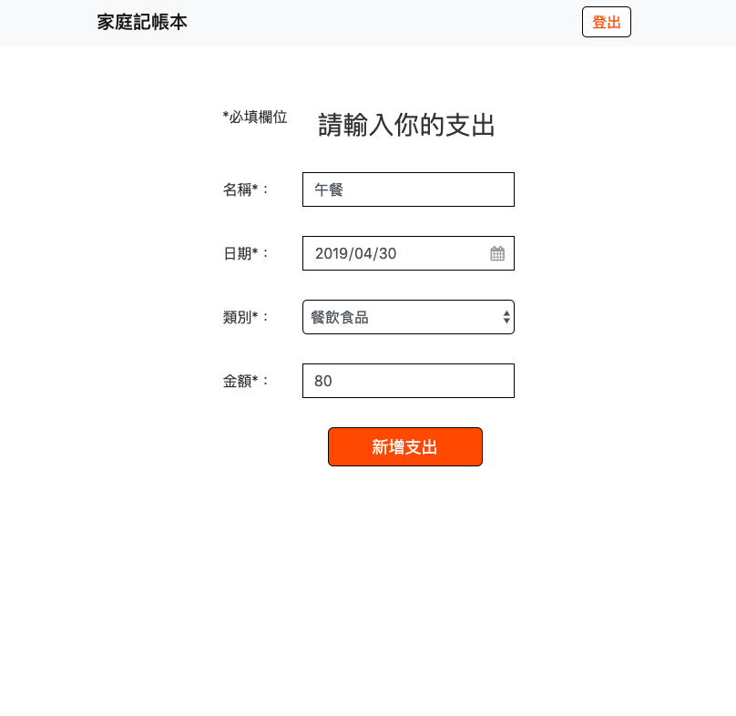

# 家庭記帳本（Expense-Tracker）

This is a website build with express and mongoDB, user can easily record their spend.

[Demo Website](https://radiant-lake-98712.herokuapp.com/)

Testing account : You can use this account to experience.

```
Email:test1@mail.com
Password:test1
```


### Feature

- you can register/login
- you can see all records on home page
- you can filter records by month and category
- you can see the total amount
- you can create a new record list
- you can edit the detail of a record
- you can delete a record



### How to install

- press "Clone or download" button to get the https URL
- type 'git clone' and paste the URL on terminal
- go into the project
- type 'node app.js' on terminal to start the server
- you can see this web on localhost:3000

### Setting

If you want to login with facebook, you have to create a file called '.env', and set the variable with your App ID、App Secret that offered by Facebook.

```
//.env
FACEBOOK_ID=your Facebook App ID
FACEBOOK_SECRET=your Facebook App Secret
FACEBOOK_CALLBACK=http://localhost:3000/auth/facebook/callback
```

### Build with

- [Express](https://expressjs.com/zh-tw/starter/installing.html)
- [Pug](https://pugjs.org/api/getting-started.html)
- [MongoDB 4.0.X](https://www.mongodb.com/download-center/community)
- [Mongoose](https://www.npmjs.com/package/mongoose)
